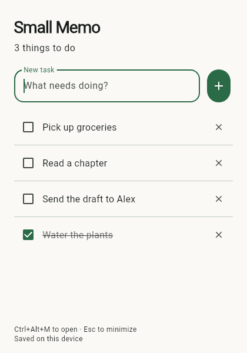

# Small Memo

A small, local todo list for **iOS, Windows, and Linux**, built with Flutter.
Create a task, check it off, and get back to what you were doing.



## First version

- One list; add tasks with Enter or the + button.
- Check and uncheck tasks. Completed tasks move below unfinished tasks.
- Delete a task with confirmation.
- Save on this device; no account, server, reminders, or subscriptions.
- Desktop: **Ctrl+Alt+M** restores and focuses the running app, **Ctrl+N**
  focuses task entry, and **Escape** minimizes it. Closing the window quits.
- iOS: launch from the home screen.

The desktop shortcut works only while the app is running. Registration can fail
if another application owns the shortcut. Linux global shortcuts use Keybinder
and target X11; Wayland support is not guaranteed. Use the taskbar if the
shortcut is unavailable. Start-at-login and a system tray are not implemented.

## Development

Install [Flutter](https://docs.flutter.dev/get-started/install). The project was
created using **Flutter 3.47.6 / Dart 3.13.5**; CI uses that Flutter version.

```sh
flutter pub get
flutter analyze
flutter test
```

### Linux (Ubuntu / Debian / Linux Mint)

```sh
sudo apt-get install clang cmake ninja-build pkg-config libgtk-3-dev libkeybinder-3.0-dev
flutter run -d linux
flutter build linux --release
```

Run `build/linux/x64/release/bundle/small_memo`. Keep the complete bundle together,
including its `lib` and `data` directories. The target machine needs GTK3 and the
Keybinder runtime (`libkeybinder-3.0-0` on Ubuntu).

### Windows

Install Visual Studio with the **Desktop development with C++** workload, then:

```powershell
flutter run -d windows
flutter build windows --release
```

The app is in `build\windows\x64\runner\Release`. Distribute the whole directory,
not just the executable. Target computers need the Visual C++ runtime.

### iOS

Use macOS with Xcode and the Flutter iOS prerequisites. Open
`ios/Runner.xcworkspace` to select your signing team and a unique bundle ID.

```sh
flutter run -d <device-id>
flutter build ios --release
```

The CI build uses `--no-codesign` to check compilation. It does **not** produce an
installable iPhone release; device distribution requires signing. There is no
App Store or TestFlight release yet.

## Storage

`tasks.json` is saved in the platform's application support directory, obtained
through `path_provider`. Tasks are plain text JSON, not encrypted. Data is local
to each device and uninstalling the app can remove it. Back up this file with the
app closed if you need to preserve it.

Each save flushes a temporary file before replacing the previous file. A process
lock prevents simultaneous app instances from writing over each other. If the
file is unreadable, the app preserves it and displays an error instead of
silently resetting your list. Changes that fail to save do not appear completed.
The store interface is separate from the UI to allow a future sync implementation.

## Sync later

Cross-device synchronization is **not implemented** in this release. Hosted sync
would need authentication, account isolation, offline retries, conflict handling,
and deletion propagation. It is more than replacing the local file with a remote
API request.

For a personal list, Supabase's free tier is a plausible future option. As checked
on October 7, 2026, it includes authentication and a 500 MB database at US$0/month;
inactive free projects pause after one week. Pro starts at US$25/month. These are
service prices, not a promise of a free production service; see
[Supabase pricing](https://supabase.com/pricing) for current terms.

## Automation

GitHub Actions runs analysis, persistence/UI tests, and native builds on Linux,
Windows, and macOS (unsigned iOS). Desktop bundles are uploaded as workflow
artifacts. Platform build success does not replace testing global shortcuts and
iOS behavior on real devices.
